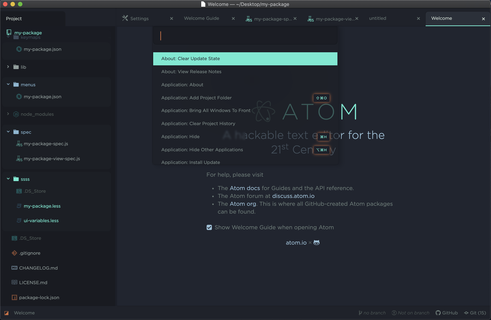
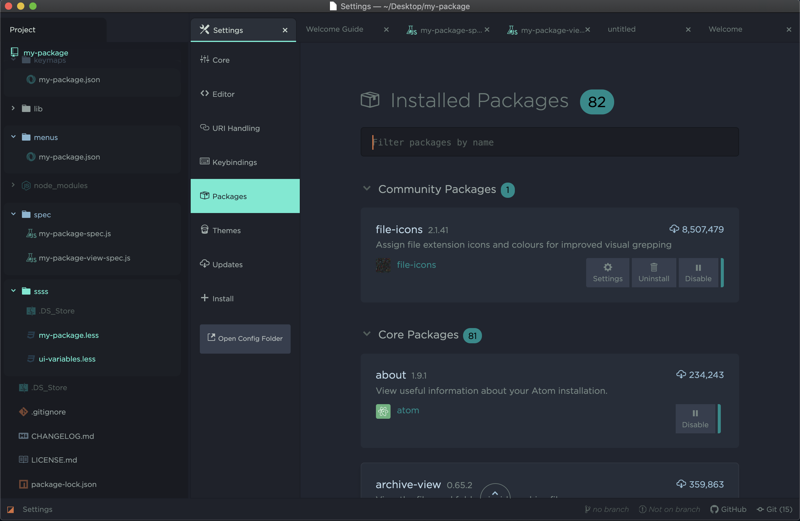
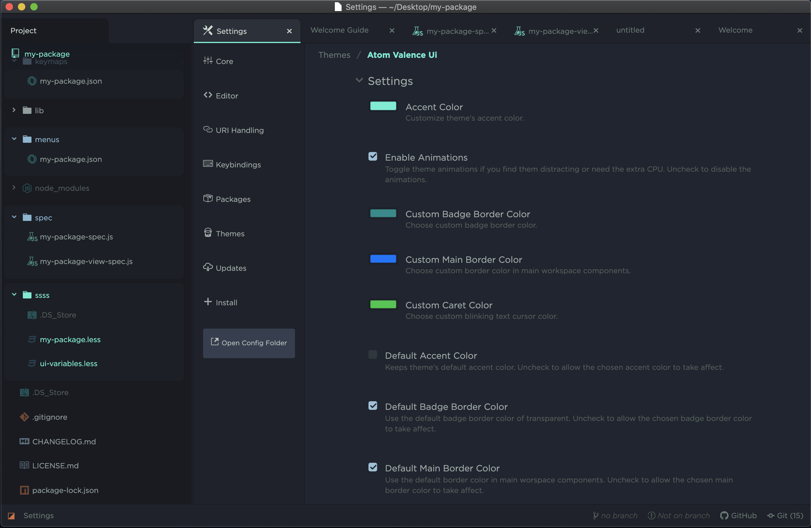
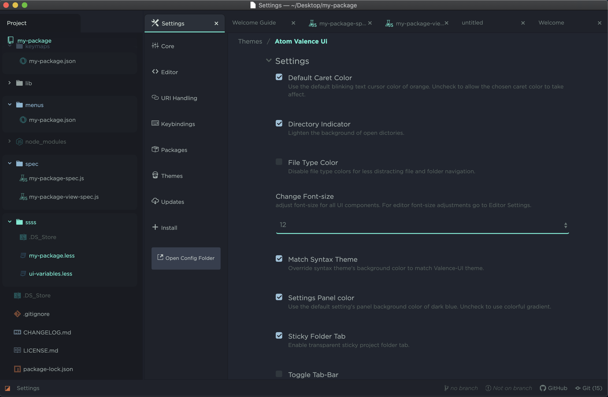

# Atom Valence UI
A customizable theme for Atom editor that focuses on delivering a clean and stylish user interface. Designed with a programmer's needs in mind, adding small usability features that will hopefully make your job easier.

influences from Silvestre Herrera's [Atom Material UI](https://github.com/atom-material/atom-material-ui) and [One Dark UI](https://github.com/atom/one-dark-ui)

#Installation
Install the 'atom-valence-ui' package from the theme repository or by using the CLI shown below.

```shell
apm install atom-valence-ui
```
#Screenshots
**Here are a few screenshots of Atom Valence UI theme**


**With optional gradient**



#Settings
Atom Valence UI supports a variety of settings and custimizations. Go to Atom's Settings > Themes (click cog icon next to theme name) > scroll through to see all settings available to make this theme yours.



Color settings have a default setting enabled when initially loaded in Atom. Don't forget to uncheck these setting to see your chosen color take affect.



While most settings should appear immediately, reloading the page will make sure all changes take affect. Changing Accent Color will require a reload to reflect color changes in the text.

#Contributing
Have suggestion? Find a bug? Feel free to fork this theme or create a PR with desired suggestions. So far I'm (will.github) the only contributor to Atom Valence UI theme, I would love to see what other do with it.

Feeling lazy but want something fixed? email me or leave a comment so I can improve this theme.


# License
Atom Material UI is licensed under MIT.
[AVU license](LICENSE.md)
